# Twitter Clone - Architecture Diagrams

This document contains various architecture diagrams for the Twitter Clone system using PlantUML format.

## Table of Contents
1. [System Overview](#system-overview)
2. [Component Architecture](#component-architecture)
3. [Database Schema](#database-schema)
4. [Authentication Flow](#authentication-flow)
5. [Tweet Creation Flow](#tweet-creation-flow)
6. [Timeline Generation Flow](#timeline-generation-flow)
7. [Deployment Architecture](#deployment-architecture)
8. [Class Diagram](#class-diagram)

---

## System Overview

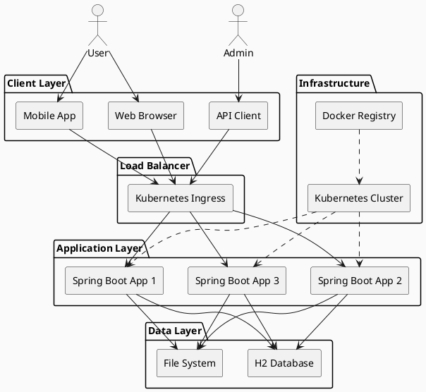

---

## Component Architecture

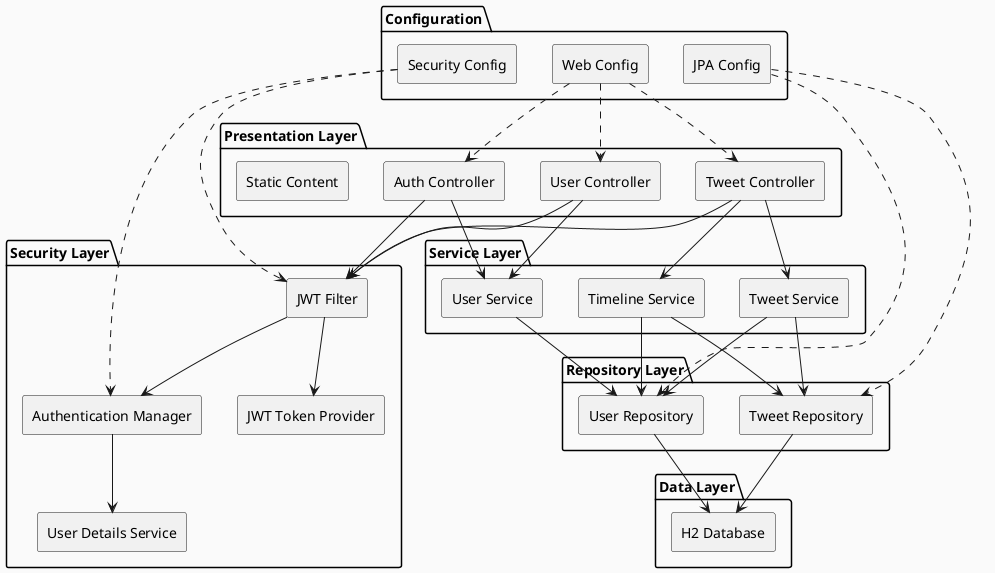

---

## Database Schema

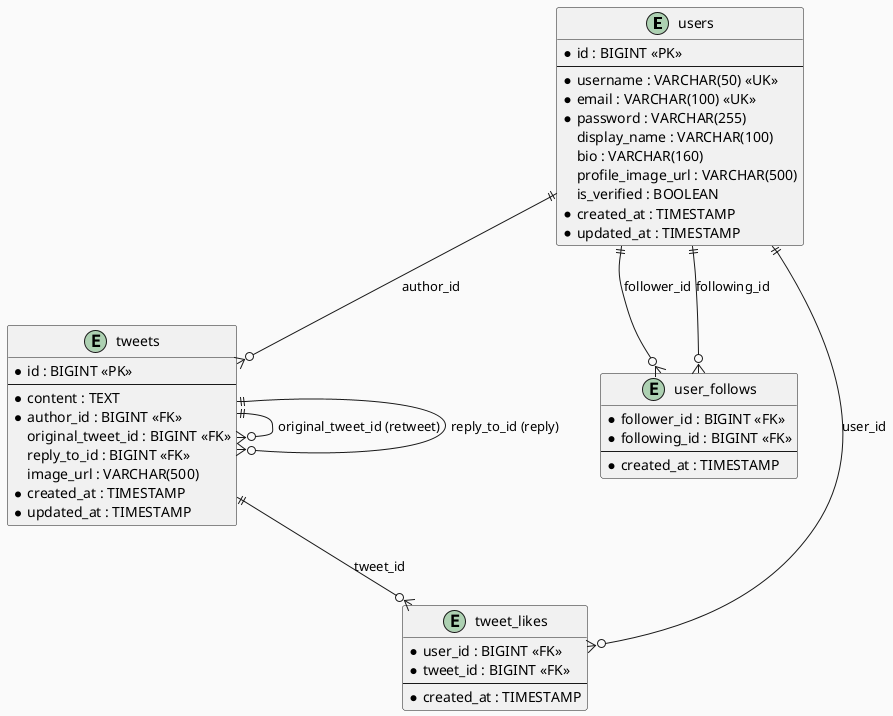

---

## Authentication Flow

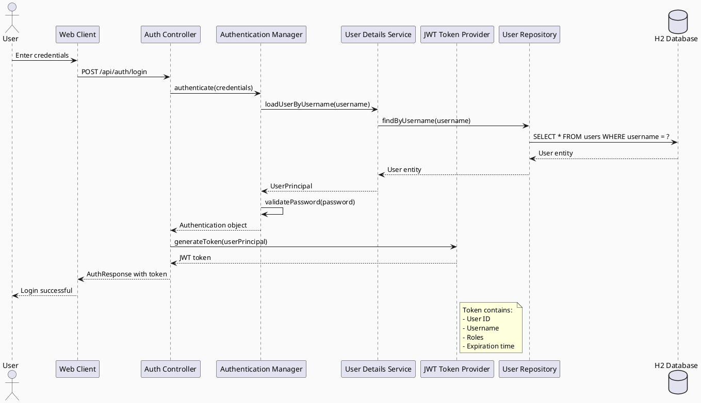

---

## Tweet Creation Flow

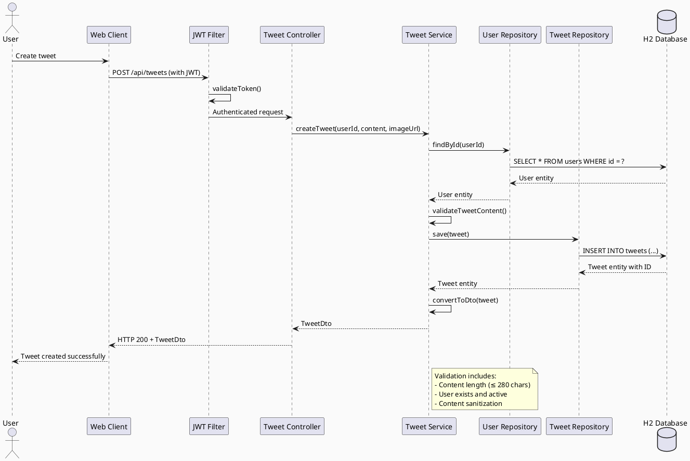

---

## Timeline Generation Flow

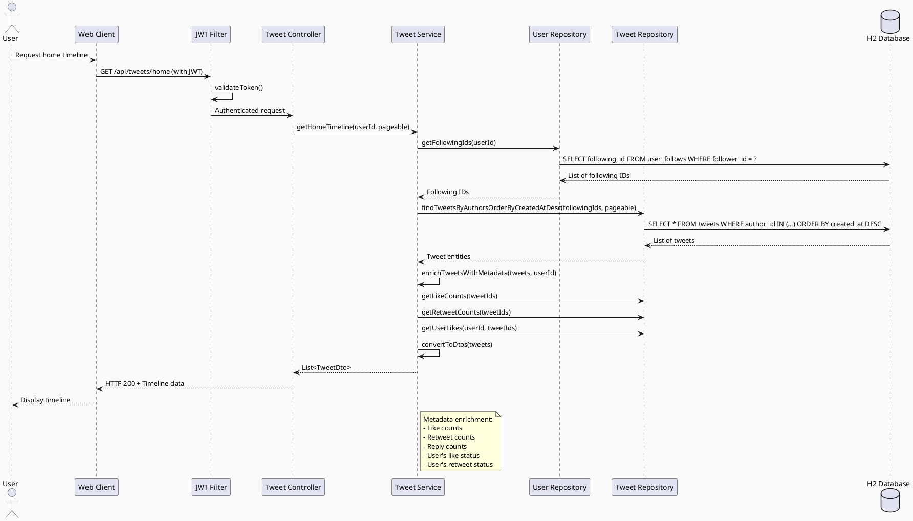

---

## Deployment Architecture

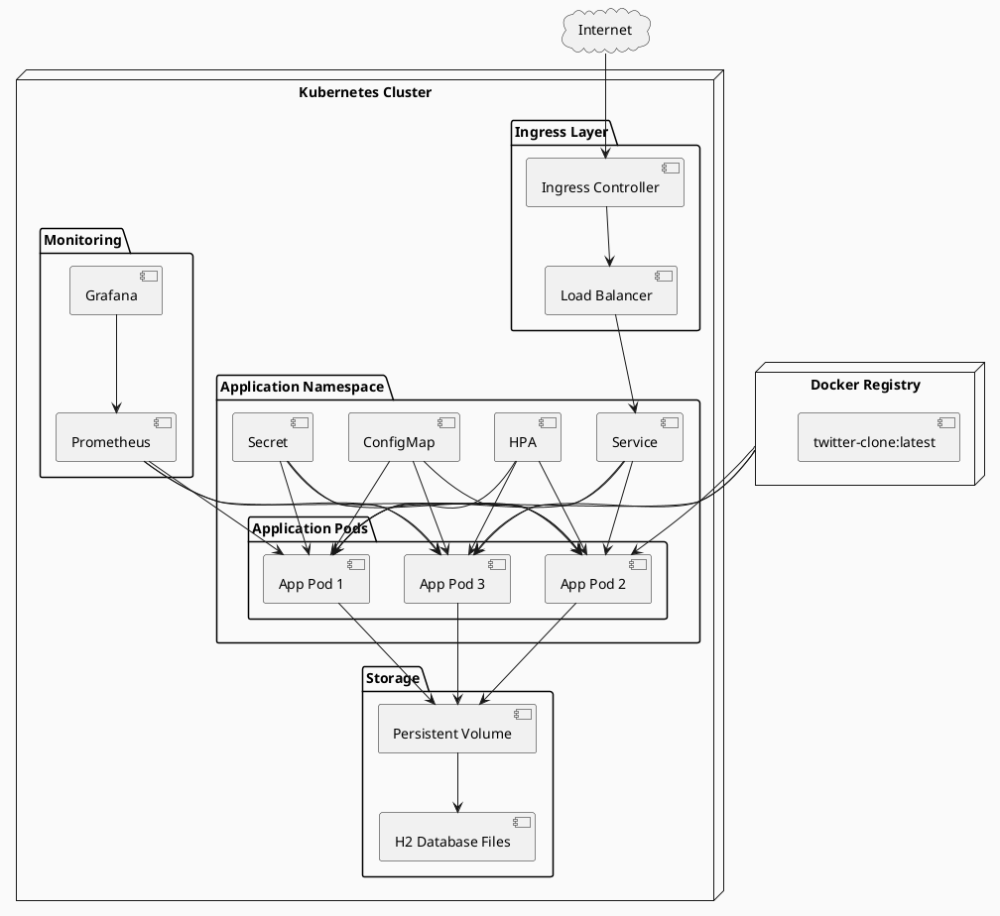

---

## Class Diagram

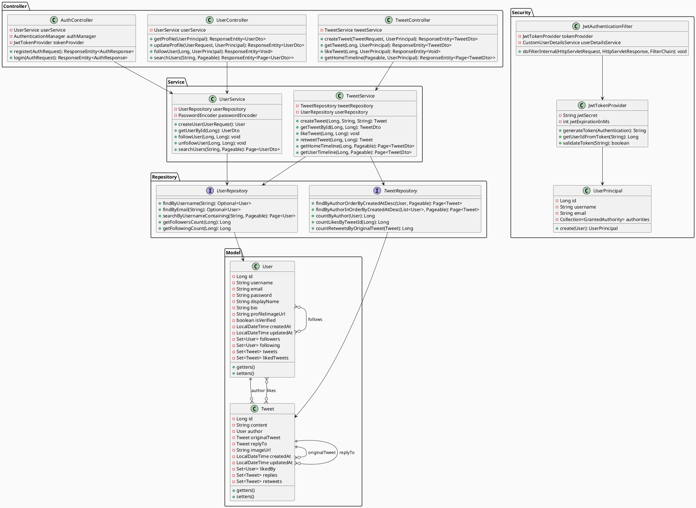

---

## Sequence Diagram - Follow User

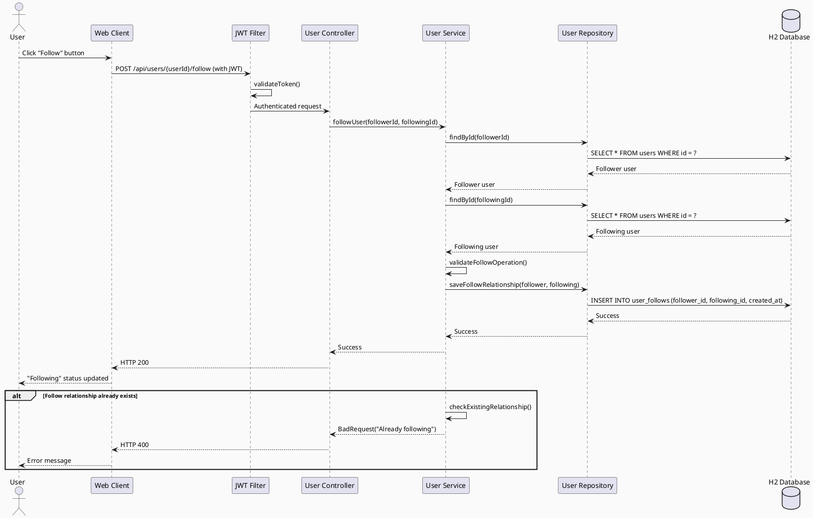

---

## Activity Diagram - Tweet Lifecycle

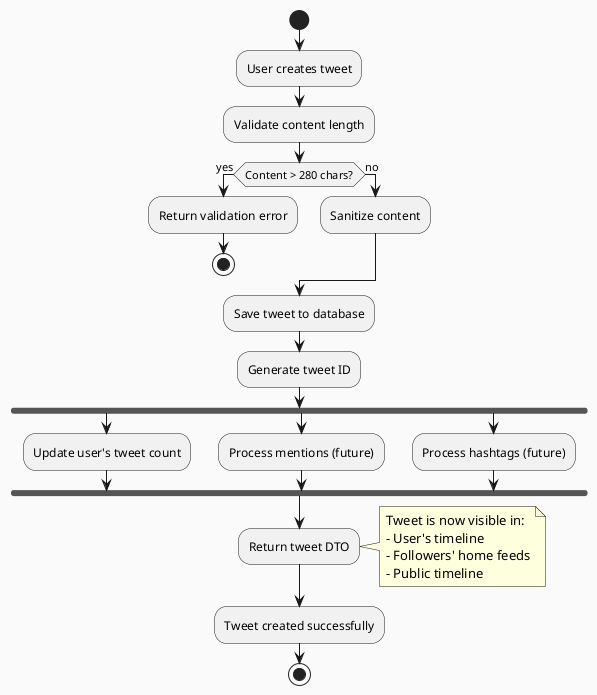

---

## State Diagram - User Account

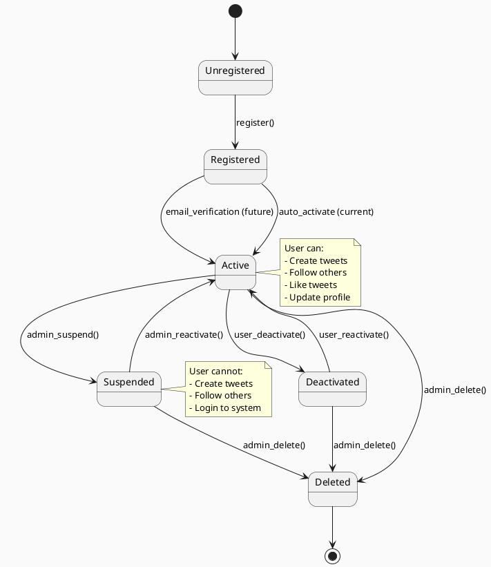

---

## Component Interaction Overview

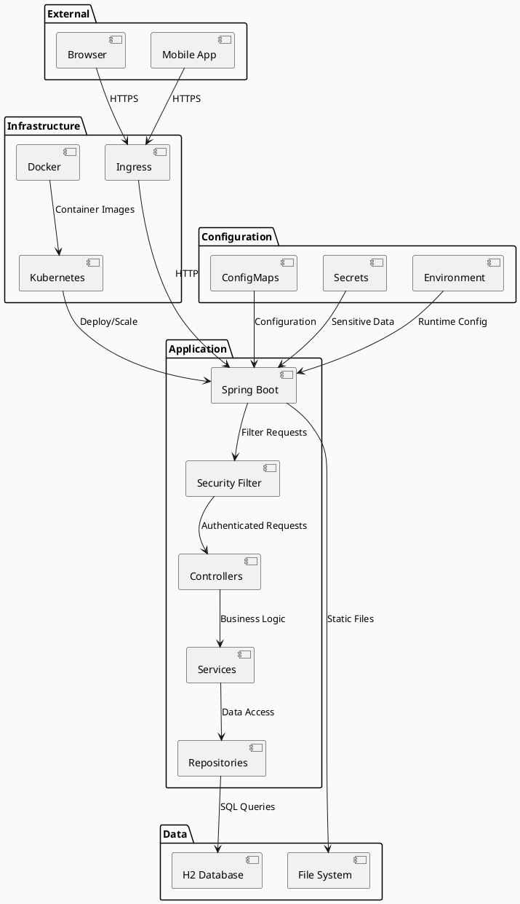

This collection of architecture diagrams provides a comprehensive visual representation of the Twitter Clone system, covering all major aspects from high-level system overview to detailed component interactions and data flows.